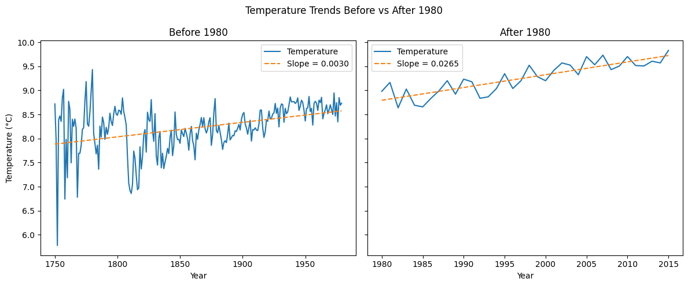
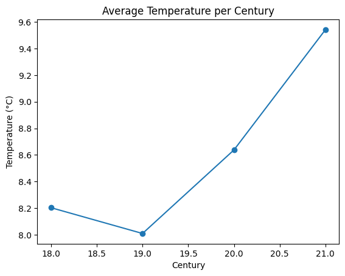
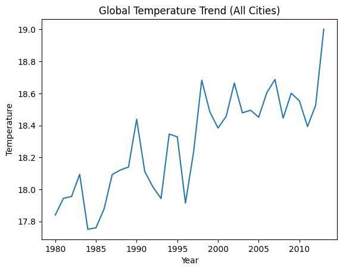
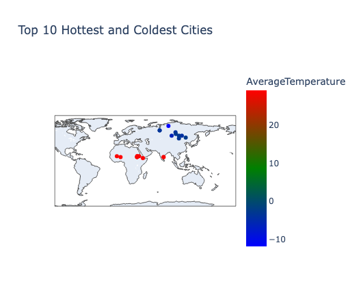
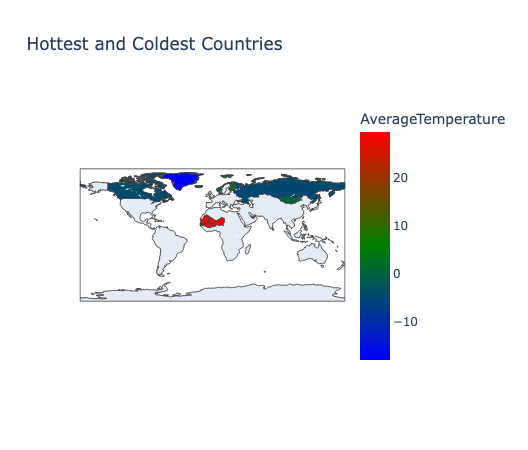
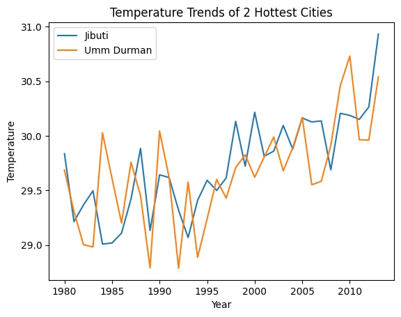
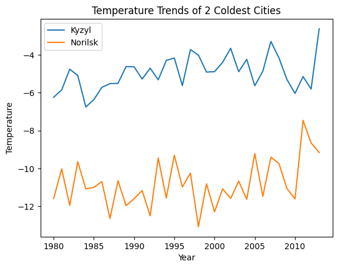
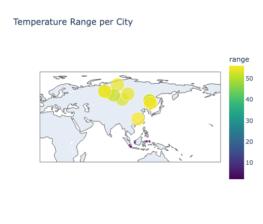
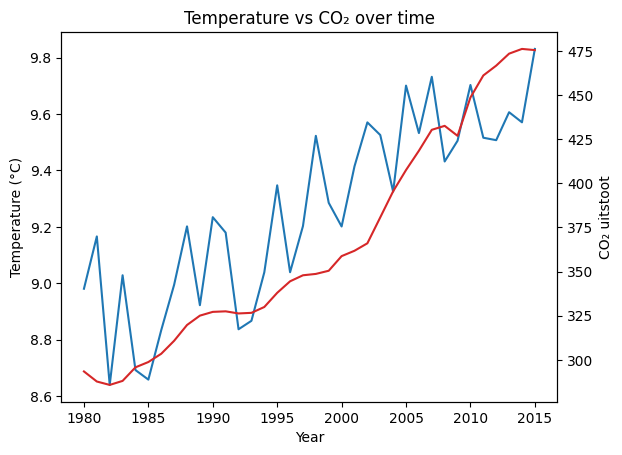

Door de data per eeuw te aggregeren, haal je de kortetermijnschommelingen eruit en wordt de langetermijntrend veel duidelijker zichtbaar. Wat opvalt is dat de temperatuur vooral vanaf de 20e eeuw sneller begint toe te nemen.

 

Ondanks de schommelingen per jaar zie je een duidelijke opwaartse trend. Door over alle steden te aggregeren wordt het globale patroon beter zichtbaar.

Deze visualisatie laat de top 10 warmste en koudste steden zien op basis van gemiddelde temperatuur. Wat opvalt is dat de warmste steden vooral rond de evenaar liggen, terwijl de koudste steden zich meer in noordelijke gebieden bevinden. Dit laat duidelijk het effect van geografische ligging op temperatuur zien.

Deze visualisatie laat de warmste en koudste landen zien op basis van gemiddelde temperatuur. Net als bij de steden zien we een duidelijk geografisch patroon: warmere landen liggen dichter bij de evenaar, terwijl koudere landen zich vooral in noordelijke breedtegraden bevinden. Door te aggregeren op landniveau wordt dit patroon nog duidelijker zichtbaar.

Deze grafiek laat de ontwikkeling van de gemiddelde wereldwijde landtemperatuur zien over de tijd. We zien een duidelijke stijgende trend, vooral vanaf de 20e eeuw. Wanneer we dit vergelijken met de CO₂-uitstoot, zien we dat beide in dezelfde periode sterk toenemen. Dit wijst op een mogelijke relatie tussen stijgende uitstoot en temperatuurverandering.

