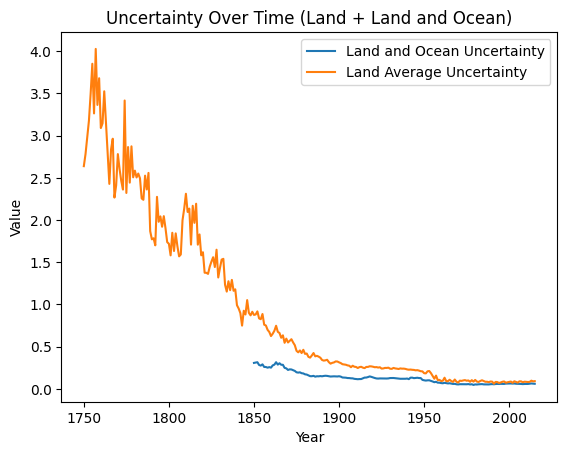
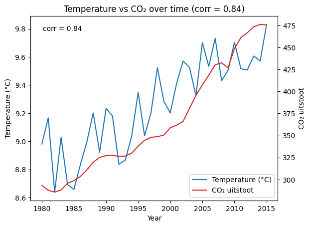
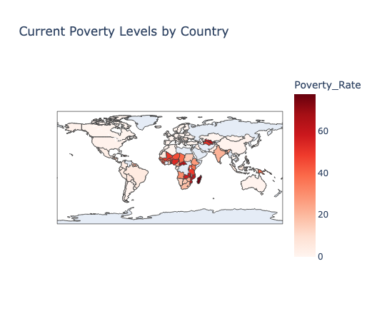
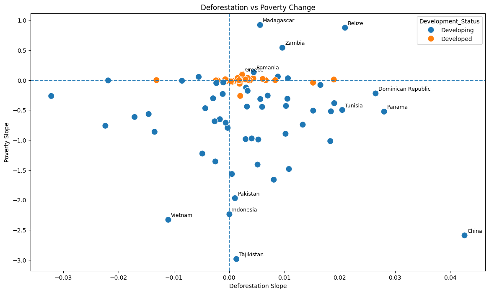
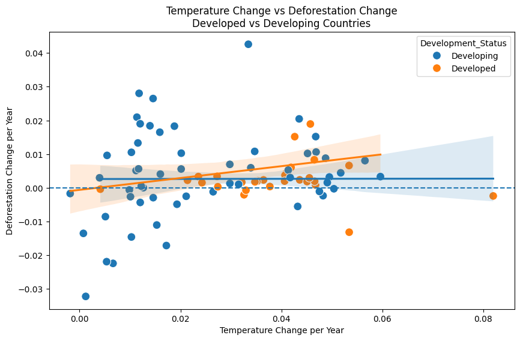

# Analyse van wereldwijde temperatuurtrends

In dit onderzoek worden historische temperatuurgegevens geanalyseerd om wereldwijde klimaattrends zichtbaar te maken. Daarnaast wordt onderzocht hoe temperatuurverandering samenhangt met andere factoren, zoals CO₂-uitstoot, armoede en ontbossing. Door verschillende datasets te combineren kunnen zowel globale trends als verschillen tussen landen onderzocht worden.

---

## Figuur 1 – Gemiddelde wereldwijde landtemperatuur per jaar

Deze grafiek toont de gemiddelde wereldwijde landtemperatuur per jaar.

In de vroege jaren (rond 1750–1800) zijn de metingen onregelmatig en schommelen ze sterk. Naarmate de tijd vordert, wordt het patroon stabieler en is een duidelijke stijgende trend zichtbaar.

Vooral vanaf de 20e eeuw neemt de temperatuur geleidelijk toe, met een sterkere stijging in de laatste decennia. Dit wijst op een duidelijke opwarming van de aarde over de lange termijn.

---

## Figuur 2 – Onzekerheid in temperatuurmetingen doorheen de tijd

Deze grafiek toont de onzekerheid in temperatuurmetingen door de tijd, voor zowel land als land en oceaan gecombineerd.

In de vroege jaren is de onzekerheid hoog en schommelt deze sterk, vooral voor landmetingen. Naarmate de tijd vordert, neemt de onzekerheid duidelijk af. Vanaf ongeveer 1850 wordt ook de gecombineerde meting van land en oceaan zichtbaar, die lager en stabieler is.

Na 1900 stabiliseren beide lijnen en blijft de onzekerheid laag, wat aangeeft dat temperatuurmetingen in de moderne periode veel betrouwbaarder zijn geworden.

---

## Figuur 3 – Evolutie van meetonzekerheid in temperatuurdata

Ook in deze visualisatie is zichtbaar dat de onzekerheid in temperatuurmetingen sterk afneemt doorheen de tijd. Vooral in de vroegste meetjaren zijn de schommelingen groot, terwijl de metingen vanaf de moderne periode veel consistenter worden.

Dit versterkt het idee dat recente temperatuurgegevens betrouwbaarder zijn en beter gebruikt kunnen worden voor langetermijnanalyses van klimaatverandering.

---

## Figuur 4 – Gemiddelde temperatuurtrend per eeuw

Door de data per eeuw te aggregeren, verdwijnen veel kortetermijnschommelingen en wordt de langetermijntrend duidelijker zichtbaar. Vooral vanaf de 20e eeuw neemt de gemiddelde temperatuur sneller toe.

Deze grafiek benadrukt dat de huidige opwarming geen tijdelijke fluctuatie lijkt te zijn, maar deel uitmaakt van een bredere stijgende trend over meerdere eeuwen.

---

## Figuur 5 – Wereldwijde temperatuurtrend op basis van steden

Ondanks de schommelingen per jaar is ook hier een duidelijke opwaartse trend zichtbaar. Door de gegevens van verschillende steden samen te voegen, wordt het globale temperatuurpatroon beter zichtbaar.

De stijgende lijn suggereert dat temperatuurverandering niet beperkt blijft tot specifieke regio’s, maar een wereldwijd fenomeen vormt.

---

# Geografische temperatuurverschillen

Naast de globale trends werd ook onderzocht hoe temperaturen verschillen tussen steden en landen.

---

## Figuur 6 – Warmste en koudste steden ter wereld

Deze visualisatie toont de top 10 warmste en koudste steden op basis van gemiddelde temperatuur. De warmste steden bevinden zich voornamelijk rond de evenaar, terwijl de koudste steden vooral in noordelijke gebieden liggen.

Dit benadrukt het sterke effect van geografische ligging en breedtegraad op temperatuur.

---

## Figuur 7 – Warmste en koudste landen ter wereld

Ook op landniveau blijft hetzelfde geografische patroon zichtbaar. Landen dichter bij de evenaar vertonen gemiddeld hogere temperaturen, terwijl noordelijke landen gemiddeld kouder blijven.

Door te aggregeren op landniveau worden regionale temperatuurverschillen duidelijk zichtbaar.

---

## Figuur 8 – Temperatuurbereik per stad

Deze visualisatie toont het temperatuurbereik per stad. Sommige steden vertonen slechts beperkte schommelingen doorheen het jaar, terwijl andere steden een veel grotere temperatuurvariatie kennen.

Dit verschil kan onder andere verklaard worden door klimaattypes, afstand tot zee en geografische ligging.

---

# Temperatuurverandering en CO₂-uitstoot

Naast temperatuurgegevens werd ook gekeken naar de relatie tussen temperatuurverandering en CO₂-uitstoot.

---

## Figuur 9 – Wereldtemperatuur en CO₂-uitstoot doorheen de tijd

Deze grafiek laat de ontwikkeling van de gemiddelde wereldwijde landtemperatuur zien over de tijd. Vooral vanaf de 20e eeuw is een duidelijke stijgende trend zichtbaar.

Wanneer deze evolutie vergeleken wordt met de CO₂-uitstoot, valt op dat beide variabelen in dezelfde periode sterk beginnen toe te nemen. Dit wijst op een mogelijke relatie tussen stijgende uitstoot en temperatuurverandering.

---

## Figuur 10 – Evolutie van temperatuurstijging over tijd

Deze grafiek toont opnieuw een duidelijke stijging van de temperatuur over meerdere decennia. De temperatuurtoename lijkt vooral sterker te worden in de recentere periodes.

---

## Figuur 11 – Temperatuurverandering per decennium

Door temperatuurverandering per decennium te bekijken, wordt zichtbaar dat de opwarming in recente decennia sneller verloopt dan in eerdere periodes.

Dit ondersteunt de hypothese dat klimaatverandering zich in de moderne periode versnelt.

---

# Klimaattrends en armoede

Naast algemene klimaattrends werd ook onderzocht of er een verband bestaat tussen klimaatverandering en sociaaleconomische factoren zoals armoede.

---

## Figuur 12 – Temperatuurtrend en huidig armoedepercentage

Om dit te onderzoeken werden de temperatuurtrends per land gekoppeld aan de meest recente armoedegegevens. Hiervoor werd gebruikgemaakt van de indicator *“Poverty headcount ratio at $1.90 a day (2011 PPP)”* uit de World Bank dataset.

De correlatiecoëfficiënt bedroeg -0,32. Dit wijst op een zwak tot matig negatief verband tussen armoede en temperatuurtrend.

Op basis van de scatterplot lijkt er geen sterk lineair verband te bestaan tussen het huidige armoedepercentage en de temperatuurtrend per land.

---

## Figuur 13 – Temperatuurverandering en verandering in armoede

Naast het huidige armoedepercentage werd ook onderzocht hoe veranderingen in armoede samenhangen met temperatuurverandering.

De correlatiecoëfficiënt tussen temperatuurverandering en armoedeverandering bedroeg 0,19. Dit wijst op een zwak positief verband tussen beide variabelen.

De scatterplot toont dat de datapunten vrij verspreid liggen. Er lijkt dus geen sterk lineair verband aanwezig te zijn.

---

## Figuur 14 – Temperatuur en armoedeverandering volgens ontwikkelingsstatus

Deze visualisatie maakt onderscheid tussen ontwikkelde en ontwikkelende landen.

Uit de grafiek blijkt dat ontwikkelde landen voornamelijk clusteren rond beperkte veranderingen in armoede, terwijl ontwikkelende landen een grotere spreiding vertonen.

De regressielijnen tonen slechts een lichte trend, wat erop wijst dat het verband tussen temperatuurverandering en armoedeverandering beperkt blijft.

---

# Ontbossing en armoede

Naast temperatuurverandering werd ook onderzocht of er een verband bestaat tussen ontbossing en veranderingen in armoede.

---

## Figuur 15 – Ontbossing en veranderingen in armoede

De correlatiecoëfficiënt bedroeg -0,04, wat erop wijst dat er nauwelijks een lineair verband bestaat tussen ontbossing en veranderingen in armoede.

De scatterplot toont dat de relatie tussen beide variabelen niet sterk uitgesproken is.

Wel zijn er enkele opvallende uitschieters zichtbaar. Dit suggereert dat de impact van ontbossing sterk kan verschillen per land en afhankelijk is van bijkomende factoren zoals economische ontwikkeling, landbouw, industrialisatie en beleid.

---

# Temperatuurverandering en ontbossing

Naast armoede werd ook onderzocht hoe temperatuurverandering samenhangt met ontbossing.

---

## Figuur 16 – Temperatuurverandering en ontbossing volgens ontwikkelingsstatus

De scatterplot toont dat er geen sterk lineair verband zichtbaar is tussen temperatuurverandering en ontbossing.

Wel valt op dat ontwikkelende landen een grotere spreiding tonen dan ontwikkelde landen.

Daarnaast lijken ontwikkelde landen gemiddeld hogere temperatuurtrends te vertonen, terwijl de veranderingen in ontbossing relatief beperkt blijven.

---

## Figuur 17 – Regressieanalyse van temperatuurverandering en ontbossing

Om verder te onderzoeken of er een lineair verband bestaat tussen temperatuurverandering en ontbossing, werd een regressieanalyse uitgevoerd voor zowel de volledige dataset als afzonderlijk voor ontwikkelde en ontwikkelende landen.

Voor de volledige dataset werd een lichte positieve regressielijn gevonden met een helling van 0,10. Het verklaarde percentage variantie bleef echter beperkt (R² = 0,027). Daarnaast bleek het verband niet statistisch significant te zijn (p = 0,135).

Bij ontwikkelde landen was de regressielijn vrijwel volledig vlak (slope = 0,001) en werd geen statistisch significant verband gevonden (p = 0,986).

Bij ontwikkelende landen werd een sterkere positieve trend waargenomen (slope = 0,176). Hoewel ook deze regressie niet statistisch significant was op het 5%-niveau (p = 0,082), ligt de p-waarde merkbaar lager dan bij ontwikkelde landen.

---

# Conclusie

Uit de analyse blijkt dat de wereldwijde temperatuur over de lange termijn duidelijk stijgt, vooral vanaf de 20e eeuw. Tegelijkertijd tonen de onzekerheidsmetingen aan dat temperatuurdata in de moderne periode betrouwbaarder zijn geworden.

Daarnaast tonen de vergelijkingen met CO₂-uitstoot, armoede en ontbossing aan dat klimaatverandering samenhangt met verschillende economische en ecologische factoren. Hoewel sommige analyses zwakke verbanden laten zien, blijken veel relaties complex en niet sterk lineair.

Vooral bij ontwikkelende landen werd een grotere spreiding zichtbaar in zowel armoede- als ontbossingstrends. Dit suggereert dat klimaatverandering niet los bekeken kan worden van bredere sociale, economische en politieke omstandigheden.

De resultaten tonen aan dat klimaatverandering een wereldwijd fenomeen is met uiteenlopende effecten per land en regio. Verdere analyses met uitgebreidere datasets en bijkomende variabelen zouden deze verbanden nog beter kunnen verklaren.

